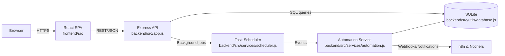
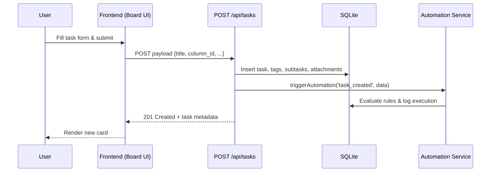

# Application Guidelines & Workflow Documentation

## 1. Product Overview
- **Purpose**: Local-first Kanban workspace with customizable boards, drag-and-drop task management, automation, and analytics backed by SQLite.【F:README.md†L1-L21】
- **Primary entry points**: React single-page app served at `http://localhost:3000` and Express API at `http://localhost:3001` when run through Docker Compose.【F:README.md†L50-L61】

## 2. Running the Stack
| Scenario | Command(s) | Notes |
| --- | --- | --- |
| One-command startup | `docker-compose up -d` | Spins up the frontend, backend, and SQLite database with persisted volumes.【F:README.md†L50-L61】 |
| Local development | `cd backend && npm run dev` (API) `cd frontend && npm start` (UI) | Install dependencies with `npm install` in each workspace first.【F:README.md†L130-L159】 |
| Default credentials | Username: `demo` Password: `demo123` | Stored in seed data for quick evaluation.【F:README.md†L60-L64】 |

## 3. System Architecture
The application separates concerns across a React SPA, an Express API, and a SQLite persistence layer. Middleware hardens the API with security headers, CORS, rate limiting, and attachment hosting before handing off to resource-specific routers.【F:backend/src/app.js†L1-L57】 The server initializes the database schema and launches a background scheduler for due-date automation when it boots.【F:backend/src/app.js†L59-L65】

## 4. Data Model Snapshot
The SQLite schema is provisioned at startup and covers boards, layout primitives, task details, collaboration metadata, and automation logs.【F:backend/src/utils/database.js†L52-L200】 Key tables:
- **boards / columns / swimlanes** – board topology, positions, and display metadata.【F:backend/src/utils/database.js†L68-L105】
- **tasks** – primary work items including priority, due dates, recurrence, ownership, and column assignments.【F:backend/src/utils/database.js†L106-L126】
- **tags, task_tags, subtasks, attachments** – supporting detail for categorization, checklists, and files.【F:backend/src/utils/database.js†L128-L168】
- **task_history** – immutable audit trail recorded via helper utilities.【F:backend/src/utils/database.js†L170-L181】【F:backend/src/utils/history.js†L3-L16】
- **integrations, automation_rules, automation_logs** – external orchestration and execution audit data.【F:backend/src/utils/database.js†L183-L200】

## 5. Backend Modules & Interfaces
| File | Purpose | Inputs | Outputs |
| --- | --- | --- | --- |
| `backend/src/app.js` | Express bootstrapper configuring security, rate limiting, static assets, and API routers before starting the scheduler. | HTTP requests on `/api/*`; environment variables for ports and CORS. | JSON responses for health, tasks, boards, etc.; runs cron scheduler on launch.【F:backend/src/app.js†L19-L71】 |
| `backend/src/routes/boards.js` | CRUD routes for boards plus nested columns/swimlanes retrieval and management. | Query params (e.g., `template`), JSON bodies for board/column definitions. | JSON collections or records with related layout data and status messages on writes.【F:backend/src/routes/boards.js†L6-L198】 |
| `backend/src/routes/tasks.js` | Comprehensive task API covering filtering, creation, updates, webhooks, subtasks, tags, and automation triggers. | Query filters, JSON payloads from UI or API-key protected webhooks, automation context. | Task listings enriched with joins; 201/200 statuses with task metadata; automation hooks via `triggerAutomation` and history records.【F:backend/src/routes/tasks.js†L42-L455】 |
| `backend/src/middleware/apiKeyAuth.js` | Guards automation/webhook endpoints with optional API key verification. | `x-api-key`/`Authorization` headers or `api_key` query; `N8N_API_KEY` env var. | 401 errors for missing/invalid keys; `next()` pass-through when valid or unset.【F:backend/src/middleware/apiKeyAuth.js†L1-L60】 |
| `backend/src/services/automation.js` | Evaluates automation rules, checks trigger predicates, and executes actions (webhook, notifications, task mutations). | Event payloads from routers/scheduler; automation rule configs from DB. | Action outcomes plus persisted automation logs; downstream notifications/webhooks.【F:backend/src/services/automation.js†L5-L195】 |
| `backend/src/services/scheduler.js` | Cron-driven background jobs for due/overdue notifications, recurring task generation, and log cleanup. | System clock; task records with due dates/recurrence. | Automation triggers, notifications, and maintenance deletions.【F:backend/src/services/scheduler.js†L7-L165】 |
| `backend/src/utils/database.js` | SQLite connection factory with Promise helpers and schema initialization. | SQL statements issued by services/routes. | Query results, run metadata, and ensured schema/tables on boot.【F:backend/src/utils/database.js†L1-L200】 |

## 6. Frontend Modules & Interfaces
| File | Role | Inputs | Outputs |
| --- | --- | --- | --- |
| `frontend/src/App.js` | Root composition layering MUI theming, global notifications, auth context, and route protection around page components. | Authentication state from context; browser routes. | Renders protected routes and redirects unauthenticated users to `/login`.【F:frontend/src/App.js†L1-L59】 |
| `frontend/src/contexts/AuthContext.js` | Manages login state, token storage, and `/api/users/me` bootstrap requests. | Credentials from login form; stored JWT token; Axios instance. | `useAuth` hook data: `isAuthenticated`, `user`, `login`, `logout`, and loading flag.【F:frontend/src/contexts/AuthContext.js†L1-L79】 |
| `frontend/src/contexts/NotificationContext.js` | Wraps Notistack to expose notification helpers across the app. | Message strings and optional variants. | Snackbar toasts via `showSuccess`, `showError`, etc.【F:frontend/src/contexts/NotificationContext.js†L1-L49】 |
| `frontend/src/services/api.js` | Axios client with base URL, auth header injection, and 401 handling. | Local storage token; REST request configs. | Authorized API calls and automatic logout redirection when tokens expire.【F:frontend/src/services/api.js†L1-L36】 |
| `frontend/src/services/boardService.js` | Convenience wrappers for board/column/swimlane REST endpoints. | Board identifiers and payloads. | Axios promises resolving to board data or mutation confirmations.【F:frontend/src/services/boardService.js†L1-L49】 |
| `frontend/src/pages/Boards.js` | Dashboard for listing, creating, duplicating, and deleting boards with Material UI components. | Authenticated user info, `boardService`, notification helpers. | Updates board grid UI, navigates to board detail, and surfaces success/error toasts.【F:frontend/src/pages/Boards.js†L1-L200】 |

## 7. Operational Workflow
1. **Authenticate** with the demo credentials or a registered account; tokens are stored in local storage and applied to subsequent API calls.【F:frontend/src/contexts/AuthContext.js†L19-L63】
2. **Browse boards** via the Boards page; initial load fetches `/api/boards` and renders cards that link to detailed board views.【F:frontend/src/pages/Boards.js†L45-L177】
3. **Create layout elements** (boards, columns, swimlanes) through dialog forms that call the respective service wrappers and REST endpoints.【F:frontend/src/pages/Boards.js†L60-L111】【F:backend/src/routes/boards.js†L78-L198】
4. **Manage tasks** by filtering, creating, updating, tagging, and attaching assets through the task routes, which also trigger automation hooks and history records.【F:backend/src/routes/tasks.js†L42-L455】
5. **Configure integrations & automation** to orchestrate n8n webhooks or notifications, secured by optional API keys, and executed by the automation service and scheduler.【F:backend/src/routes/tasks.js†L216-L284】【F:backend/src/middleware/apiKeyAuth.js†L1-L60】【F:backend/src/services/automation.js†L5-L195】【F:backend/src/services/scheduler.js†L7-L128】

## 8. Data Flow Example – Task Creation
The following sequence captures a user creating a task from the board UI:

- **Frontend** collects task details and posts to `/api/tasks` through service wrappers (not shown) similar to board operations.【F:frontend/src/pages/Boards.js†L60-L111】
- **API** validates inputs, inserts the record with related tags/subtasks, and returns the enriched task payload.【F:backend/src/routes/tasks.js†L200-L455】
- **Automation** evaluates rules (move, update, create, webhook) and logs outcomes after each trigger.【F:backend/src/services/automation.js†L5-L195】

## 9. Automation & Integrations
- Webhook/N8N endpoints reuse task routes secured by API key middleware so automations can manage work items safely from external systems.【F:backend/src/routes/tasks.js†L216-L284】【F:backend/src/middleware/apiKeyAuth.js†L1-L60】
- Scheduler jobs emit due/overdue events, create recurring tasks, and prune log history, ensuring time-based workflows fire without user action.【F:backend/src/services/scheduler.js†L11-L128】
- Automation actions include webhook calls, notifications, task moves, and task updates/creations, giving rule builders flexibility to react to events.【F:backend/src/services/automation.js†L81-L181】

---
Use this document as a quick-start reference for onboarding contributors, operating the stack locally, and understanding how data flows between the React UI, Express API, and automation subsystems.
